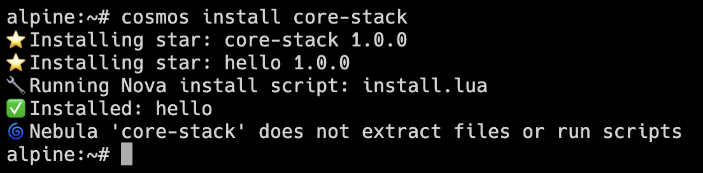

# 🌌 Cosmos

> The package manager for when your distribution is on fire—or just extremely minimal.

**Cosmos is a minimal, musl-friendly, static-binary-only package manager for people who want to build, install, and repair Linux systems with zero runtime dependencies and zero patience for bloat.**

---

## 🧠 What Is Cosmos?

Cosmos is a statically linked, offline-friendly, interpreter-free package manager. It was designed for:

- Bootstrapping systems from scratch
- Initramfs, embedded, and recovery environments
- Fully custom distros (like Wombat Linux)
- Minimal or purpose-built Linux deployments
- Developers who want reproducible installs without shell drama

Terminology:

- [**Galaxy**](https://docs.cosmos-pkg.org/18-Galaxies): A repository of packages
- [**Star**](https://docs.cosmos-pkg.org/21-Contribution-Guide-for-Maintainers): An individual package
- [**Nebula**](https://docs.cosmos-pkg.org/04-Nebula-vs-Constellation/#what-is-a-nebula): A group of Stars (meta-package)
- [**Constellation**](https://docs.cosmos-pkg.org/04-Nebula-vs-Constellation/#what-is-a-constellation): A preset list of Stars to install
- [**Universe**](https://docs.cosmos-pkg.org/03-File-Formats/#universetoml): Local package database/tracking system

---

## ❓ Why Cosmos?

Because sometimes you don’t want a package manager. You want a surgical tool.

- Static, small, zero-runtime package installs
- No shell dependencies or dynamic linking
- Built for bootstrapping, initramfs, embedded, or minimal distros

See the [Design Rationale](https://github.com/cosmospkg/cosmos-docs/blob/main/docs/14-Design-Rationale.md) for more philosophy and tech comparisons.

---

## ✨ Features

- ✅ Written in Rust
- ✅ Under 4MB binary size on musl libc
- ✅ No Bash, no Python, no dynamic linking
- ✅ Offline installs from USB or local files
- ✅ Nova: Safe Lua scripting for builds and installs (like shell scripts but cleaner and saner)
- ✅ Stellar: Package builder CLI (define, fetch, build—no Makefiles, no nonsense)
- ✅ Universe TOML tracking system
- ✅ C FFI via cbindgen
- ✅ Host Galaxies from USB, HTTP, S3, or even `python3 -m http.server`
- ✅ Modular transport layer: `file://` and HTTP included by default. HTTPS, IPFS, and others available via optional features.

---

## ⭐ Example Usage
Quick install flow example:
```bash
cosmos sync
cosmos install core-stack
cosmos install --constellation desktop.toml
```

Quick build flow example:
```bash
stellar new-star hello
# Edit star.toml + add files/ and install.lua
stellar fetch ./hello
stellar build-star ./hello
```

---

## 🖼️ In Action



---

## 📚 Documentation

📖 Full documentation lives in the [`cosmos-docs`](https://github.com/cosmospkg/cosmos-docs/tree/main/docs/) repository.

📖 [Full Documentation →](https://docs.cosmos-pkg.org)

Includes:
- Install and usage guides
- Star and Galaxy file formats
- Nova scripting reference
- FAQ and bootstrapping

---

## 💥 When to Use Cosmos

Cosmos isn’t here to replace Apt, Pacman, or Nix—it’s for when they’re down, broken, overkill, or not even possible.
Perfect for embedded systems, recovery environments, custom initramfs, and everything in between.

See the [Design Rationale](https://github.com/cosmospkg/cosmos-docs/blob/main/docs/14-Design-Rationale.md) for comparisons and guiding principles.

---

## 🛡️ Security
> Cosmos assumes trusted networks or pre-verified sources. Don't use it to install packages from sketchy URLs unless you enjoy rootkits and regret.

Cosmos does not require TLS or GPG. HTTP and `file://` transports are supported by default.
Optional features allow enabling HTTPS and other protocols via the modular `cosmos-transport` layer.

Cosmos prioritizes simplicity, readability, and explicit trust boundaries.

Read the [Security Model](https://github.com/cosmospkg/cosmos-docs/tree/main/docs/14-Security.md)

---

## 🧪 Build Notes

See [BUILDING.md](./BUILDING.md) for:
- Glibc vs Musl targets
- Static linking instructions
- Binary size tips and `strip` usage

---

## 🤝 Contributing

Cosmos is modular, documented, and snarky.
You can help by:

- Writing Stars or Nova scripts
- Building Galaxies
- Improving Stellar or Nova
- Proposing new commands or safety features

Start here: [Contribution Guide](https://github.com/cosmospkg/cosmos-docs/tree/main/docs/20-Cosmos-Contribution.md)

---

## 🏮 License

MIT. No contributor agreement. No drama.

## 🚭️ Philosophy
Cosmos exists for the systems no one else wants to deal with. It’s for the broken, the weird, the embedded, and the intentionally small. Where other package managers assume DNS resolution, working SSL, a functioning shell, and five runtime daemons, Cosmos assumes a USB stick and sheer force of will. It doesn't aim to be elegant or extensible—it aims to work, when and where nothing else does.

If you’ve ever fixed a system by hand-editing `/etc`, this is your vibe.

# 🫂 Support
- [Ko-Fi](https://ko-fi.com/afroraydude)

> Cosmos is not for everyone.  
> It’s for people who fix their systems with tarballs and spite—or build systems that never needed help to begin with.
> 
